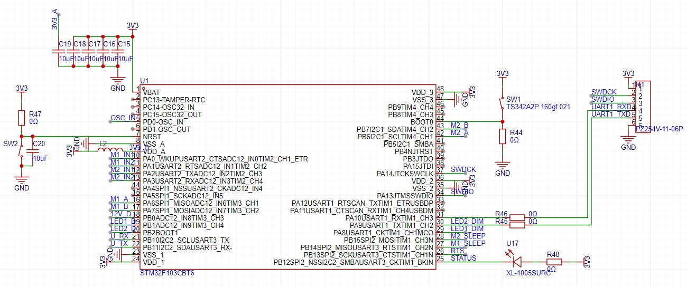
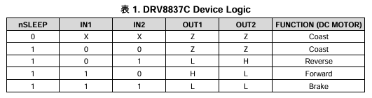

# 硬件设计

## MCU接口

### 直流电机接口

#### 输出

- M1_EN，驱动使能，高电平有效
- M1_IN1
- M1_IN2
- M2_EN，驱动使能，高电平有效
- M2_IN1
- M2_IN2 

驱动芯片为[DRV8837](https://www.ti.com/cn/lit/ds/symlink/drv8837c.pdf)，真值表：

#### 输入

- M1_A
- M1_B
- M2_A
- M2_B

霍尔编码器信号，电机每转7个脉冲。

### LED接口

#### 输入

- LED1_D
- LED2_D

LED接口插入检测，高电平有效。

#### 输出

- LED1_DIM
- LED2_DIM

LED调光信号，PWM信号，频率为1KHz。

### 12V电源

#### 输入

- 12V_D

12V电源接口插入检测，高电平有效。

### 异步串口

- USB转USART3

### 调试接口

- SWD
- USART1

### 状态指示LED

- STATUS

## v1.0A

1. 注意DC插头封装。
